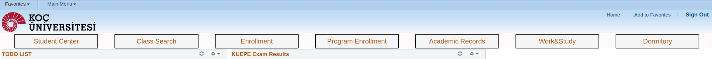
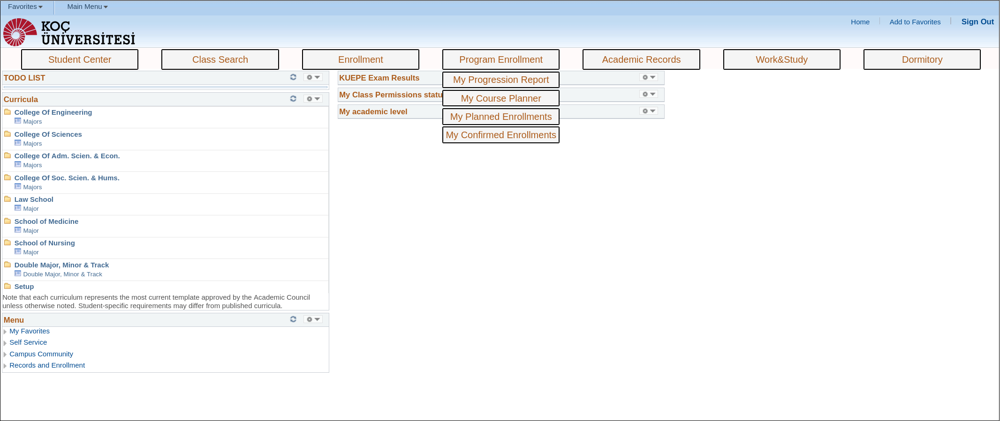

# kusisbar
a browser addon to add navigation bar to KUSIS and makes Koç University logo clickable.

Clicking on the Koç Üniversitesi logo on the top left returns you to the main KUSIS page. 
The navigation bar <i>should</i> appear and work in every KUSIS page.
The main buttons themselves are not clickable but hovering on them will create clickable new buttons.

The addon is tested only on Firefox for Linux, but it should work for other browsers as well.

## Installation

Currently the only way of installing is downloading (or cloning) this repository and installing the addon manually.
